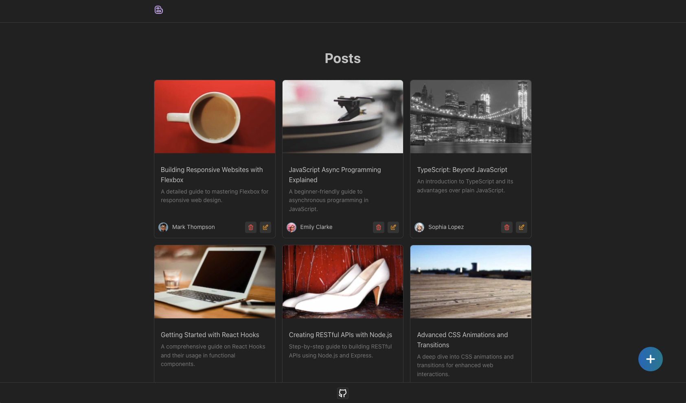

# Blog POC

A blog proof of concept for managing blog post.

&nbsp;

This is a simple proof of concept for a blog post manager. The blog is user friendly and easy to interact with and has key functionalities such as create, edit, delete, and view blog posts.

&nbsp;

## Features

- ✔️ List Posts
- ✔️ Edit Posts
- ✔️ Delete Posts through homepage and also post page.
- ✔️ Create Post
- ✔️ Pagination
- ✔️ Bookmarkable post listings.
- ✔️ Bookmarkable posts
- ✔️ Rich text Editor for designing Posts
- ✔️ Automatic validation for Form fields
- ✔️ Responsive Design
- ✔️ A11Y compliant

&nbsp;

## Built With

- JavaScript, TypeScript, React, Next.js
- Hooks, Mantine UI, Tiptap
- TailWindCss, Css modules.
- Jest, React-testing-library, Jest-axe, zod, day.js
- Axios , json-server

## Getting Started

To get a local copy up and running follow these simple example steps.

### Prerequisites

To run this project, you will need to have `node`,`npm` or `yarn`, `TypeScript` already installed locally

### Setup

`Clone the project and cd into the directory`

### Install

run `npm install` or `yarn` to install all the dependencies of the project.

### Add env file

create a `.env` file in the project root directory and add the following env vars:

- API_BASE_URL : This is a url which `json-server` will run on example: `http://localhost:4000`

### Usage

run `npm dev` or `yarn dev` to get the project running

open browser and navigate to `http://localhost:3000/`

&nbsp;

### Customizations

The styles are written using css modules and extend default Mantine Ui styles.

To tweak Next.js(React) components navigate to following directories

- `/components`
- `/containers`
- `/features`
- `/routes`

To access application theming navigate to `theme.ts`

To access global styles navigate to `/src/styles/index.css`

See [Mantine UI](https://mantine.dev/) documentation for how to theme and tweak relevant styles

&nbsp;

## Tests

Mostly Integration are written.

To access tests they can be found in components that require testing.

### Running Tests

run `npm test` or `yarn test` to get the tests running

- `typecheck` – checks TypeScript types
- `lint` – runs ESLint
- `prettier:check` – checks files with Prettier
- `jest` – runs jest tests
- `jest:watch` – starts jest watch
- `test` – runs `jest`, `prettier:check`, `lint` and `typecheck` scripts

### Other scripts

- `prettier:write` – formats all files with Prettier

#### Analysis report

&nbsp;

## Deployment

run `npm build` or `yarn build` to generate build folder. You can now serve the build folder on any server. for more information visit [Next.js](https://nextjs.org/docs/pages/building-your-application/deploying).

&nbsp;

## Authors

👤 **Author**

- Github: [solomonakp](https://github.com/solomonakp)
- twitter: [@dev_chuck](https://twitter.com/dev_chuck)

&nbsp;

## 📝 License

This project is [MIT](lic.url) licensed.
